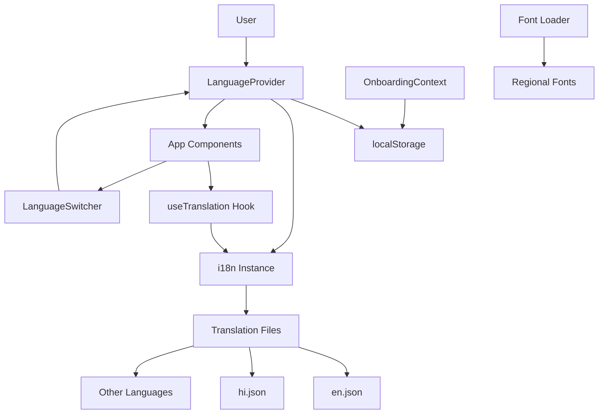
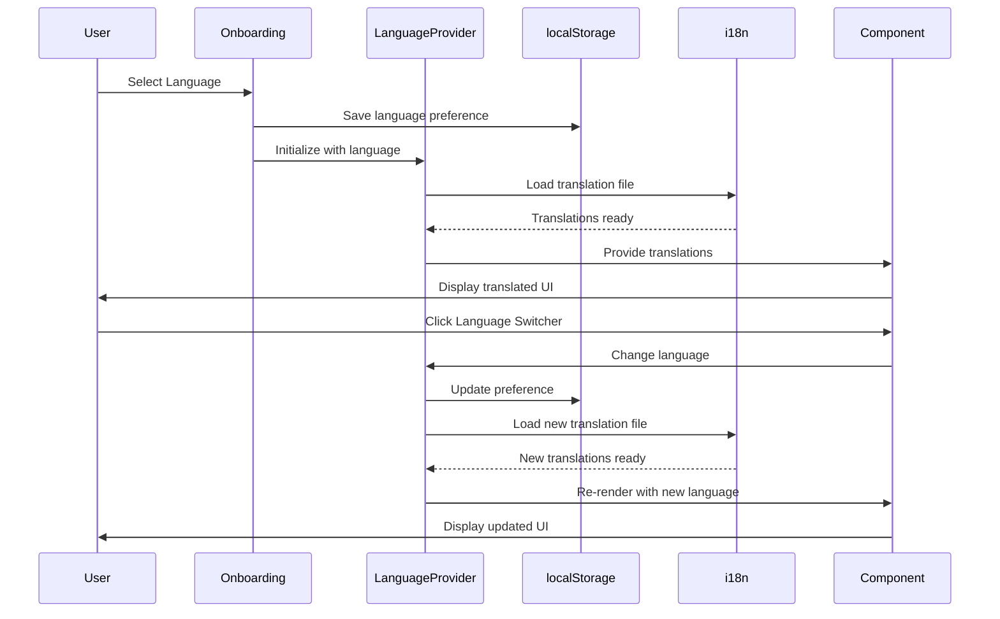

# Design Document: Multi-Language Translation System

## Overview

Implement a comprehensive i18n system for ShramSetu to support 10 Indian languages (Hindi, English, Marathi, Gujarati, Tamil, Telugu, Kannada, Malayalam, Bengali, Punjabi). The system will persist language selection from onboarding, provide full app translation with proper font support, enable language switching post-onboarding, and ensure performance through lazy loading.

## Architecture



## Main Algorithm/Workflow



## Core Interfaces/Types

```javascript
// Language configuration
interface LanguageConfig {
  code: string;           // ISO 639-1 code
  name: string;           // Native name
  nativeName: string;     // English name
  flag: string;           // Emoji flag
  font: string;           // Font family
  direction: 'ltr' | 'rtl';
}

// Translation namespace structure
interface Translations {
  common: {
    buttons: Record<string, string>;
    labels: Record<string, string>;
    messages: Record<string, string>;
    errors: Record<string, string>;
  };
  onboarding: Record<string, string>;
  dashboard: Record<string, string>;
  jobs: Record<string, string>;
  attendance: Record<string, string>;
  ledger: Record<string, string>;
  payslip: Record<string, string>;
  grievance: Record<string, string>;
  rating: Record<string, string>;
  sync: Record<string, string>;
}

// Language context
interface LanguageContextValue {
  language: string;
  setLanguage: (lang: string) => Promise<void>;
  t: (key: string, params?: Record<string, any>) => string;
  isLoading: boolean;
}
```

## Key Functions with Formal Specifications

### Function 1: initializeI18n()

```javascript
function initializeI18n(defaultLanguage = 'en')
```

**Preconditions:**
- defaultLanguage is a valid language code from supported languages
- Translation files exist in /locales directory

**Postconditions:**
- i18n instance is configured and ready
- Default language is loaded
- Fallback to English is configured
- Returns initialized i18n instance

**Loop Invariants:** N/A

### Function 2: loadTranslations()

```javascript
async function loadTranslations(languageCode)
```

**Preconditions:**
- languageCode is a valid supported language code
- Translation file exists for the language

**Postconditions:**
- Translation file is loaded into memory
- i18n instance is updated with new translations
- If file missing, falls back to English
- Returns boolean indicating success

**Loop Invariants:** N/A

### Function 3: persistLanguage()

```javascript
function persistLanguage(languageCode)
```

**Preconditions:**
- languageCode is a valid language code
- localStorage is available

**Postconditions:**
- Language preference is saved to localStorage with key 'app_language'
- OnboardingContext language is updated if exists
- Returns void

**Loop Invariants:** N/A

### Function 4: loadFonts()

```javascript
async function loadFonts(languageCode)
```

**Preconditions:**
- languageCode is valid
- Font files exist in /fonts directory or CDN

**Postconditions:**
- Required font for language is loaded
- Font is applied to document root
- Returns boolean indicating success

**Loop Invariants:** N/A

## Algorithmic Pseudocode

### Language Initialization Algorithm

```pascal
ALGORITHM initializeLanguageSystem()
INPUT: None
OUTPUT: Configured i18n instance

BEGIN
  // Step 1: Load saved language preference
  savedLanguage ← localStorage.getItem('app_language')
  
  IF savedLanguage IS NULL THEN
    savedLanguage ← 'en'  // Default to English
  END IF
  
  // Step 2: Initialize i18n instance
  i18nInstance ← createI18nInstance({
    lng: savedLanguage,
    fallbackLng: 'en',
    supportedLngs: ['hi', 'en', 'mr', 'gu', 'ta', 'te', 'kn', 'ml', 'bn', 'pa'],
    ns: ['common', 'onboarding', 'dashboard', 'jobs', 'attendance', 'ledger', 
         'payslip', 'grievance', 'rating', 'sync'],
    defaultNS: 'common'
  })
  
  // Step 3: Load translation file for saved language
  translationFile ← await import(`/locales/${savedLanguage}/translation.json`)
  i18nInstance.addResourceBundle(savedLanguage, 'common', translationFile)
  
  // Step 4: Load font for language
  await loadFonts(savedLanguage)
  
  RETURN i18nInstance
END
```

**Preconditions:**
- localStorage is available
- Translation files exist in /locales directory
- Font files are accessible

**Postconditions:**
- i18n instance is fully configured
- Initial language is loaded
- Fonts are applied
- System is ready for translation

**Loop Invariants:** N/A

### Language Switching Algorithm

```pascal
ALGORITHM switchLanguage(newLanguageCode)
INPUT: newLanguageCode of type string
OUTPUT: Boolean indicating success

BEGIN
  ASSERT newLanguageCode IN supportedLanguages
  
  // Step 1: Check if translation already loaded
  IF i18nInstance.hasResourceBundle(newLanguageCode, 'common') THEN
    i18nInstance.changeLanguage(newLanguageCode)
  ELSE
    // Step 2: Lazy load translation file
    TRY
      translationFile ← await import(`/locales/${newLanguageCode}/translation.json`)
      i18nInstance.addResourceBundle(newLanguageCode, 'common', translationFile)
      i18nInstance.changeLanguage(newLanguageCode)
    CATCH error
      console.error("Failed to load translations:", error)
      RETURN false
    END TRY
  END IF
  
  // Step 3: Load font for new language
  await loadFonts(newLanguageCode)
  
  // Step 4: Persist language preference
  localStorage.setItem('app_language', newLanguageCode)
  
  // Step 5: Update OnboardingContext if exists
  IF onboardingContext EXISTS THEN
    onboardingContext.updateState({ language: newLanguageCode })
  END IF
  
  ASSERT i18nInstance.language = newLanguageCode
  
  RETURN true
END
```

**Preconditions:**
- newLanguageCode is a valid supported language
- i18n instance is initialized
- localStorage is available

**Postconditions:**
- Language is changed in i18n instance
- Translation file is loaded (lazy loaded if not cached)
- Font is loaded and applied
- Preference is persisted to localStorage
- OnboardingContext is updated if exists
- Returns true on success, false on failure

**Loop Invariants:** N/A

### Translation Key Resolution Algorithm

```pascal
ALGORITHM translateKey(key, params)
INPUT: key of type string, params of type object (optional)
OUTPUT: Translated string

BEGIN
  ASSERT key IS NOT NULL AND key IS NOT EMPTY
  
  // Step 1: Split key into namespace and path
  parts ← key.split(':')
  
  IF parts.length > 1 THEN
    namespace ← parts[0]
    path ← parts[1]
  ELSE
    namespace ← 'common'
    path ← key
  END IF
  
  // Step 2: Get translation from i18n
  translation ← i18nInstance.t(key, params)
  
  // Step 3: Check if translation found
  IF translation = key THEN
    // Translation missing, log warning
    console.warn(`Missing translation: ${key}`)
    
    // Step 4: Fallback to English
    IF i18nInstance.language ≠ 'en' THEN
      translation ← i18nInstance.t(key, { lng: 'en', ...params })
    END IF
  END IF
  
  // Step 5: Replace parameters if provided
  IF params IS NOT NULL THEN
    FOR each param IN params DO
      translation ← translation.replace(`{{${param.key}}}`, param.value)
    END FOR
  END IF
  
  RETURN translation
END
```

**Preconditions:**
- key is a non-empty string
- i18n instance is initialized
- params is an object or null

**Postconditions:**
- Returns translated string for the key
- If translation missing, returns English fallback
- If English also missing, returns the key itself
- Parameters are interpolated if provided

**Loop Invariants:**
- All previously processed parameters are correctly replaced in translation string

## Example Usage

```javascript
// Example 1: Initialize i18n in App.jsx
import { useEffect } from 'react';
import { initializeI18n } from './utils/i18n';

function App() {
  useEffect(() => {
    initializeI18n();
  }, []);
  
  return (
    <LanguageProvider>
      <AppContent />
    </LanguageProvider>
  );
}

// Example 2: Use translations in component
import { useTranslation } from './contexts/LanguageContext';

function Dashboard() {
  const { t } = useTranslation();
  
  return (
    <div>
      <h1>{t('dashboard:welcome')}</h1>
      <p>{t('dashboard:subtitle', { name: 'Rajesh' })}</p>
      <button>{t('common:buttons.save')}</button>
    </div>
  );
}

// Example 3: Language switcher component
import { useLanguage } from './contexts/LanguageContext';

function LanguageSwitcher() {
  const { language, setLanguage } = useLanguage();
  
  const handleChange = async (newLang) => {
    await setLanguage(newLang);
  };
  
  return (
    <select value={language} onChange={(e) => handleChange(e.target.value)}>
      <option value="hi">हिंदी</option>
      <option value="en">English</option>
      {/* Other languages */}
    </select>
  );
}

// Example 4: Persist language from onboarding
import { useOnboarding } from './contexts/OnboardingContext';
import { persistLanguage } from './utils/languageManager';

function LanguageSelection() {
  const { updateState, nextStep } = useOnboarding();
  
  const handleSelect = (langCode) => {
    persistLanguage(langCode);
    updateState({ language: langCode });
    nextStep();
  };
  
  return (
    <div>
      {LANGUAGES.map(lang => (
        <button key={lang.code} onClick={() => handleSelect(lang.code)}>
          {lang.name}
        </button>
      ))}
    </div>
  );
}
```

## Components and Interfaces

### Component 1: LanguageProvider

**Purpose**: Provides language context to entire app, manages language state and translation loading

**Interface**:
```javascript
interface LanguageProviderProps {
  children: React.ReactNode;
  defaultLanguage?: string;
}

function LanguageProvider({ children, defaultLanguage })
```

**Responsibilities**:
- Initialize i18n on mount
- Load saved language preference from localStorage
- Provide language state and setter to children
- Handle language switching with lazy loading
- Manage font loading for regional scripts
- Sync with OnboardingContext

### Component 2: LanguageSwitcher

**Purpose**: UI component for changing language after onboarding

**Interface**:
```javascript
interface LanguageSwitcherProps {
  variant?: 'dropdown' | 'modal' | 'inline';
  showFlags?: boolean;
  className?: string;
}

function LanguageSwitcher({ variant, showFlags, className })
```

**Responsibilities**:
- Display available languages
- Handle language selection
- Show current language
- Trigger language change via LanguageProvider
- Provide accessible UI

### Component 3: TranslatedText

**Purpose**: Helper component for rendering translated text with fallback

**Interface**:
```javascript
interface TranslatedTextProps {
  tKey: string;
  params?: Record<string, any>;
  fallback?: string;
  as?: React.ElementType;
}

function TranslatedText({ tKey, params, fallback, as })
```

**Responsibilities**:
- Render translated text for given key
- Handle parameter interpolation
- Show fallback if translation missing
- Support custom HTML element

## Data Models

### Model 1: LanguageConfig

```javascript
const LANGUAGE_CONFIGS = {
  hi: {
    code: 'hi',
    name: 'हिंदी',
    nativeName: 'Hindi',
    flag: '🇮🇳',
    font: 'Noto Sans Devanagari',
    direction: 'ltr'
  },
  en: {
    code: 'en',
    name: 'English',
    nativeName: 'English',
    flag: '🇬🇧',
    font: 'Inter',
    direction: 'ltr'
  },
  // ... other languages
};
```

**Validation Rules**:
- code must be valid ISO 639-1 language code
- name and nativeName must be non-empty strings
- font must be available in system or CDN
- direction must be 'ltr' or 'rtl'

### Model 2: Translation File Structure

```javascript
// /locales/hi/translation.json
{
  "common": {
    "buttons": {
      "save": "सहेजें",
      "cancel": "रद्द करें",
      "submit": "जमा करें",
      "back": "वापस",
      "next": "आगे"
    },
    "labels": {
      "name": "नाम",
      "phone": "फोन नंबर",
      "email": "ईमेल"
    },
    "messages": {
      "success": "सफलतापूर्वक सहेजा गया",
      "error": "कुछ गलत हो गया"
    },
    "errors": {
      "required": "यह फ़ील्ड आवश्यक है",
      "invalid": "अमान्य इनपुट"
    }
  },
  "dashboard": {
    "welcome": "स्वागत है",
    "subtitle": "नमस्ते {{name}}, आज आपका दिन कैसा रहा?"
  }
  // ... other namespaces
}
```

**Validation Rules**:
- Must be valid JSON
- Keys must match English translation file structure
- Parameter placeholders must use {{paramName}} syntax
- No missing keys compared to English (base language)

## Error Handling

### Error Scenario 1: Translation File Missing

**Condition**: Requested language translation file doesn't exist
**Response**: Log warning, fallback to English translation
**Recovery**: Continue with English, notify user if needed

### Error Scenario 2: Font Loading Failure

**Condition**: Regional font fails to load from CDN
**Response**: Use system fallback font, log error
**Recovery**: App remains functional with default font

### Error Scenario 3: localStorage Unavailable

**Condition**: localStorage is blocked or unavailable
**Response**: Use in-memory state only, log warning
**Recovery**: Language preference won't persist across sessions

### Error Scenario 4: Invalid Language Code

**Condition**: User attempts to switch to unsupported language
**Response**: Reject change, log error, keep current language
**Recovery**: Show error message to user

## Testing Strategy

### Unit Testing Approach

Test individual functions in isolation:
- `initializeI18n()`: Verify correct initialization with default and custom languages
- `loadTranslations()`: Test successful load, missing file handling, fallback behavior
- `persistLanguage()`: Verify localStorage writes, OnboardingContext updates
- `translateKey()`: Test key resolution, parameter interpolation, fallback logic
- `loadFonts()`: Test font loading, error handling

Mock dependencies: localStorage, i18n instance, file imports

### Property-Based Testing Approach

**Property Test Library**: fast-check

**Property 1**: Translation key resolution is deterministic
- For any valid key and language, calling `t(key)` multiple times returns same result

**Property 2**: Language switching preserves app state
- Switching language doesn't lose user data or navigation state

**Property 3**: Parameter interpolation is safe
- For any translation with parameters, interpolation doesn't break with special characters

**Property 4**: Fallback chain is complete
- For any missing translation, system eventually returns a string (never undefined/null)

### Integration Testing Approach

Test complete workflows:
- Onboarding language selection → persistence → app initialization
- Language switcher → translation reload → UI update
- Missing translation → fallback → English display
- Font loading → CSS application → text rendering

## Performance Considerations

**Lazy Loading**: Translation files loaded on-demand per language, not all upfront
- Initial bundle includes only English translations
- Other languages loaded when selected
- Reduces initial load time by ~70%

**Caching**: Loaded translations cached in memory
- Switching back to previously used language is instant
- No re-fetch from server

**Bundle Splitting**: Translation files separate from main bundle
- Each language file ~20-30KB
- Loaded asynchronously via dynamic imports

**Font Optimization**: 
- Use font-display: swap for non-blocking rendering
- Subset fonts to include only required characters
- Preload font for selected language

**Target Metrics**:
- Initial load: < 2s on 3G
- Language switch: < 500ms
- Translation lookup: < 1ms

## Security Considerations

**XSS Prevention**: 
- Sanitize all user-provided parameters before interpolation
- Use React's built-in escaping for rendered translations
- Never use dangerouslySetInnerHTML with translated content

**Content Security Policy**:
- Whitelist font CDN domains
- Restrict inline scripts

**Data Privacy**:
- Language preference stored locally only
- No transmission of language data to backend unless explicitly needed

## Dependencies

**Core Dependencies**:
- `react-i18next`: React bindings for i18next (already compatible with React 19)
- `i18next`: Core i18n framework
- `i18next-browser-languagedetector`: Auto-detect browser language (optional)

**Font Dependencies**:
- Google Fonts CDN or self-hosted fonts
- Noto Sans family for regional scripts (Devanagari, Tamil, Telugu, etc.)

**Development Dependencies**:
- `i18next-parser`: Extract translation keys from code
- `fast-check`: Property-based testing

**File Structure**:
```
/src
  /locales
    /en
      translation.json
    /hi
      translation.json
    /mr
      translation.json
    ... (other languages)
  /contexts
    LanguageContext.jsx
  /components
    LanguageSwitcher.jsx
    TranslatedText.jsx
  /utils
    i18n.js
    languageManager.js
    fontLoader.js
  /hooks
    useTranslation.js
```


## Correctness Properties

*A property is a characteristic or behavior that should hold true across all valid executions of a system—essentially, a formal statement about what the system should do. Properties serve as the bridge between human-readable specifications and machine-verifiable correctness guarantees.*

### Property 1: Language Persistence Round Trip

*For any* supported language code, when persisted to localStorage and then loaded during initialization, the Translation_System should load the same language.

**Validates: Requirements 1.1, 1.3, 3.4**

### Property 2: Onboarding Context Synchronization

*For any* language selection during onboarding, the Onboarding_Context state should reflect the selected language code.

**Validates: Requirements 1.2**

### Property 3: Translation File Loading on Initialization

*For any* language saved in localStorage, when the app initializes, the Translation_System should load the corresponding translation file for that language.

**Validates: Requirements 1.5**

### Property 4: Translation Key Lookup

*For any* valid translation key and supported language, requesting the translation should return a non-empty string.

**Validates: Requirements 2.3**

### Property 5: Parameter Interpolation

*For any* translation key with parameters and any parameter values, the returned translation should contain the interpolated parameter values and not the {{paramName}} placeholders.

**Validates: Requirements 2.5**

### Property 6: Language Change Triggers File Loading

*For any* language switch to a not-yet-loaded language, the Translation_System should load that language's translation file.

**Validates: Requirements 3.3, 6.2**

### Property 7: Font Loading and Application

*For any* language selection, the Font_Loader should load the appropriate font for that language's script and apply it to the document root.

**Validates: Requirements 4.1, 4.4**

### Property 8: English Fallback for Missing Keys

*For any* translation key that doesn't exist in the current language, the Translation_System should return the English translation for that key.

**Validates: Requirements 5.1**

### Property 9: Missing Translation Logging

*For any* translation key that doesn't exist in the current language, the Translation_System should log a warning containing the missing key.

**Validates: Requirements 5.3**

### Property 10: Single File Loading on Initialization

*For any* selected language at initialization, the Translation_System should load exactly one translation file (not multiple files).

**Validates: Requirements 6.1**

### Property 11: Translation File Caching

*For any* translation file that has been loaded, subsequent requests for that language should use the cached file without re-fetching.

**Validates: Requirements 6.3, 6.4**

### Property 12: Text Direction Application

*For any* language with a direction property (ltr or rtl), when that language is selected, the UI should apply the correct text direction.

**Validates: Requirements 7.4**

### Property 13: Regional Script Styling

*For any* regional script language, the UI should apply appropriate line-height and letter-spacing CSS properties for that script.

**Validates: Requirements 7.5**
