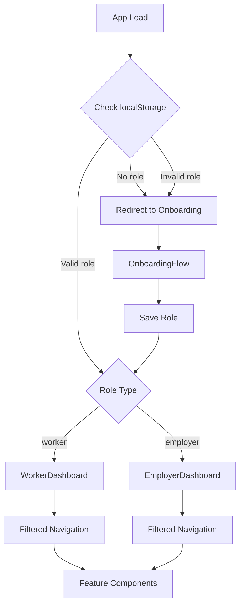

# Design Document: Role-Based Dashboards

## Overview

This design implements role-based routing and separate dashboards for Worker and Employer users in ShramSetu. The system will persist user roles selected during onboarding and provide tailored navigation experiences based on role-specific feature access.

The implementation maintains the existing tab-based navigation pattern (no React Router) while introducing two new dashboard components that filter and organize features according to user roles. The design prioritizes minimal changes to existing components and reuses the current navigation structure.

### Key Design Decisions

1. **No React Router**: Continue using tab-based state management with `activeTab` state variable
2. **Role Persistence**: Store role in both localStorage (`user_role`) and User_Profile object
3. **Component Reuse**: Existing feature components remain unchanged; dashboards control visibility
4. **Graceful Degradation**: Missing or invalid roles trigger onboarding redirect

## Architecture

### Component Hierarchy

```
App
├── OnboardingFlow (if not onboarded)
└── Dashboard (if onboarded)
    ├── WorkerDashboard (if role === 'worker')
    │   ├── Navigation (filtered tabs)
    │   └── Content (role-appropriate features)
    └── EmployerDashboard (if role === 'employer')
        ├── Navigation (filtered tabs)
        └── Content (role-appropriate features)
```

### Data Flow



## Components and Interfaces

### 1. RoleManager Utility

A utility module for role persistence and validation.

**Location**: `src/utils/roleManager.js`

**Interface**:
```javascript
// Save role after onboarding
function saveRole(role: 'worker' | 'employer'): void

// Retrieve saved role
function getRole(): 'worker' | 'employer' | null

// Validate role value
function isValidRole(role: string): boolean

// Clear role (for re-onboarding)
function clearRole(): void

// Check if user has access to feature
function hasFeatureAccess(role: string, feature: string): boolean
```

**Storage Keys**:
- `user_role`: Primary role storage in localStorage
- `onboarding_complete`: Existing flag, remains unchanged

### 2. WorkerDashboard Component

**Location**: `src/components/dashboard/WorkerDashboard.jsx`

**Props**:
```javascript
{
  onRestartOnboarding: () => void  // Callback to restart onboarding
}
```

**State**:
```javascript
{
  activeTab: string  // Current active tab ('home', 'jobs', 'attendance', etc.)
}
```

**Features Included**:
- Job Search (find jobs by skills/location)
- Attendance (TOTP input and log)
- E-Khata Ledger (wage tracking)
- Payslip Auditor (payslip verification)
- Grievance Redressal (safety reporting)
- Rating System (rate employers)
- Sync (offline data management)
- Voice Interface
- AI Assistant

**Features Excluded**:
- Session Start (TOTP creation)
- Talent Search

### 3. EmployerDashboard Component

**Location**: `src/components/dashboard/EmployerDashboard.jsx`

**Props**:
```javascript
{
  onRestartOnboarding: () => void  // Callback to restart onboarding
}
```

**State**:
```javascript
{
  activeTab: string  // Current active tab ('home', 'talent-search', 'session-start', etc.)
}
```

**Features Included**:
- Talent Search (find workers by skills/location)
- Session Start (TOTP attendance creation)
- E-Khata Ledger (payment tracking)
- Grievance Redressal (view reports)
- Rating System (rate workers)
- Sync (offline data management)
- Voice Interface
- AI Assistant

**Features Excluded**:
- Job Search
- Attendance (TOTP input)
- Payslip Auditor

### 4. Modified App Component

**Changes Required**:
1. Import `WorkerDashboard` and `EmployerDashboard`
2. Import `roleManager` utility
3. Add role state: `const [userRole, setUserRole] = useState(null)`
4. Check role on mount and after onboarding
5. Conditionally render dashboard based on role
6. Pass `handleStartOnboarding` to dashboards

**Role Check Logic**:
```javascript
useEffect(() => {
  const onboardingComplete = localStorage.getItem('onboarding_complete')
  const role = getRole()
  
  if (onboardingComplete === 'true' && isValidRole(role)) {
    setIsOnboarded(true)
    setUserRole(role)
  } else {
    setIsOnboarded(false)
    setUserRole(null)
  }
}, [])
```

### 5. Modified OnboardingContext

**Changes Required**:
1. Import `roleManager` utility
2. Call `saveRole(state.role)` in `completeOnboarding` function
3. Call `clearRole()` in `resetOnboarding` function

**Updated completeOnboarding**:
```javascript
const completeOnboarding = () => {
  // Save role to localStorage
  if (state.role) {
    saveRole(state.role)
  }
  
  setState(prev => ({
    ...prev,
    completedAt: Date.now(),
    lastSavedAt: Date.now()
  }))
  
  clearProgress()
  
  if (onComplete) {
    onComplete()
  }
}
```

## Data Models

### Role Type

```javascript
type Role = 'worker' | 'employer'
```

### Feature Access Map

```javascript
const FEATURE_ACCESS = {
  worker: [
    'home',
    'voice',
    'jobs',           // Job Search
    'attendance',     // TOTP Input
    'attendance-log',
    'ledger',
    'payslip',
    'grievance',
    'rating',
    'sync',
    'ai-assistant'
  ],
  employer: [
    'home',
    'voice',
    'talent-search',  // Talent Search (replaces jobs)
    'session-start',  // TOTP Creation
    'totp-display',
    'ledger',
    'grievance',
    'rating',
    'sync',
    'ai-assistant'
  ]
}
```

### Navigation Tab Configuration

```javascript
const WORKER_TABS = [
  { id: 'home', label: '🏠 Home' },
  { id: 'voice', label: '🎙️ Voice Interface' },
  { id: 'jobs', label: '📍 Job Search' },
  { id: 'attendance', label: '✅ Mark Attendance' },
  { id: 'attendance-log', label: '📊 Attendance Log' },
  { id: 'ledger', label: '💰 E-Khata' },
  { id: 'payslip', label: '📄 Payslip' },
  { id: 'grievance', label: '🛡️ Grievance' },
  { id: 'rating', label: '⭐ Rating' },
  { id: 'sync', label: '📱 Sync' },
  { id: 'ai-assistant', label: '🤖 AI Assistant' }
]

const EMPLOYER_TABS = [
  { id: 'home', label: '🏠 Home' },
  { id: 'voice', label: '🎙️ Voice Interface' },
  { id: 'talent-search', label: '🔍 Talent Search' },
  { id: 'session-start', label: '📋 Create Session' },
  { id: 'totp-display', label: '🔢 TOTP Display' },
  { id: 'ledger', label: '💰 E-Khata' },
  { id: 'grievance', label: '🛡️ Grievance' },
  { id: 'rating', label: '⭐ Rating' },
  { id: 'sync', label: '📱 Sync' },
  { id: 'ai-assistant', label: '🤖 AI Assistant' }
]
```

### Session Storage for Tab Persistence

```javascript
const TAB_STORAGE_KEY = 'active_tab'

// Save active tab
function saveActiveTab(tab: string): void {
  sessionStorage.setItem(TAB_STORAGE_KEY, tab)
}

// Load active tab
function loadActiveTab(): string | null {
  return sessionStorage.getItem(TAB_STORAGE_KEY)
}

// Clear active tab
function clearActiveTab(): void {
  sessionStorage.removeItem(TAB_STORAGE_KEY)
}
```


## Correctness Properties

*A property is a characteristic or behavior that should hold true across all valid executions of a system—essentially, a formal statement about what the system should do. Properties serve as the bridge between human-readable specifications and machine-verifiable correctness guarantees.*

### Property 1: Role Persistence After Onboarding

*For any* valid role ('worker' or 'employer'), when onboarding is completed with that role, the system should persist the role to both localStorage (key 'user_role') and the User_Profile object.

**Validates: Requirements 1.1, 1.2, 1.3**

### Property 2: Role Validation

*For any* string value, the system should only accept 'worker' or 'employer' as valid roles, rejecting all other values.

**Validates: Requirements 1.3**

### Property 3: Role Retrieval on Load

*For any* valid role stored in localStorage, when the application loads, the system should retrieve and use that role for dashboard routing.

**Validates: Requirements 1.4**

### Property 4: Invalid Role Handling

*For any* application load where no role is found or an invalid role value exists in localStorage, the system should redirect to the onboarding flow.

**Validates: Requirements 1.5, 9.1, 9.2**

### Property 5: Role-Based Dashboard Routing

*For any* user with a persisted role, the system should display WorkerDashboard when role is 'worker' and EmployerDashboard when role is 'employer'.

**Validates: Requirements 2.1, 2.2, 2.3**

### Property 6: Dashboard Persistence Across Sessions

*For any* user who completes onboarding, when the application is restarted, the system should route to the appropriate dashboard without requiring re-onboarding.

**Validates: Requirements 2.4**

### Property 7: Worker Dashboard Required Features

*For any* WorkerDashboard instance, the navigation should include all required features: Job Search, Attendance, E-Khata Ledger, Payslip Auditor, Grievance Redressal, Rating System, and Sync.

**Validates: Requirements 3.1, 3.2, 3.3, 3.4, 3.5, 3.6, 3.7**

### Property 8: Worker Dashboard Excluded Features

*For any* WorkerDashboard instance, the navigation should not include Session Start or Talent Search features.

**Validates: Requirements 3.8, 3.9**

### Property 9: Employer Dashboard Required Features

*For any* EmployerDashboard instance, the navigation should include all required features: Talent Search, Session Start, E-Khata Ledger, Grievance Redressal, Rating System, and Sync.

**Validates: Requirements 4.1, 4.2, 4.3, 4.4, 4.5, 4.6**

### Property 10: Employer Dashboard Excluded Features

*For any* EmployerDashboard instance, the navigation should not include Job Search, Attendance (TOTP input), or Payslip Auditor features.

**Validates: Requirements 4.7, 4.8, 4.9**

### Property 11: Shared Feature Access

*For any* dashboard (Worker or Employer), the navigation should include the shared features: E-Khata Ledger, Grievance Redressal, Rating System, and Sync.

**Validates: Requirements 5.1, 5.2, 5.3, 5.4**

### Property 12: Job Marketplace Role Adaptation

*For any* user accessing the Job Marketplace feature, the system should display Job Search interface when role is 'worker' and Talent Search interface when role is 'employer'.

**Validates: Requirements 6.1, 6.2**

### Property 13: Access Control Enforcement

*For any* attempt to access a role-restricted feature, the system should display an access denied message or hide the navigation button when the user's role does not have permission.

**Validates: Requirements 7.1, 7.2, 7.3, 7.4**

### Property 14: Invalid Access Redirect

*For any* failed role validation when accessing a feature, the system should redirect to the appropriate dashboard home.

**Validates: Requirements 7.6**

### Property 15: Onboarding Restart Cleanup

*For any* user who clicks "Restart Onboarding", the system should clear both the saved role from localStorage and the User_Profile data.

**Validates: Requirements 8.1, 8.2**

### Property 16: Onboarding Restart Navigation

*For any* user who clicks "Restart Onboarding", the system should redirect to the onboarding flow.

**Validates: Requirements 8.3**

### Property 17: Role Change Round Trip

*For any* user who restarts onboarding and selects a new role, when onboarding completes, the system should save the new role and route to the corresponding dashboard.

**Validates: Requirements 8.4, 8.5**

### Property 18: Feature Data Preservation

*For any* existing localStorage data for features (attendance, jobs, ledger), the system should preserve this data when implementing role-based routing.

**Validates: Requirements 9.3**

### Property 19: Tab State Updates

*For any* user switching tabs within their dashboard, the system should update the activeTab state to reflect the current tab.

**Validates: Requirements 10.1**

### Property 20: Tab Persistence After Refresh

*For any* user who refreshes the page, the system should restore the last active tab if it is valid for their role, otherwise default to the dashboard home.

**Validates: Requirements 10.2, 10.3**

### Property 21: Tab State Storage

*For any* tab switch within a dashboard, the system should save the activeTab state to sessionStorage.

**Validates: Requirements 10.4**

### Property 22: Tab State Cleanup

*For any* user who logs out or restarts onboarding, the system should clear the activeTab state from sessionStorage.

**Validates: Requirements 10.5**

## Error Handling

### Role Validation Errors

**Scenario**: Invalid or missing role in localStorage
- **Detection**: Check role value on app load
- **Response**: Redirect to onboarding flow
- **User Feedback**: None (seamless redirect)
- **Logging**: Log invalid role value for debugging

**Scenario**: Corrupted localStorage data
- **Detection**: JSON parse errors or missing required fields
- **Response**: Clear corrupted data and redirect to onboarding
- **User Feedback**: None (seamless redirect)
- **Logging**: Log error details for debugging

### Access Control Errors

**Scenario**: User attempts to access restricted feature
- **Detection**: Check role against feature access map
- **Response**: Display access denied message or hide navigation
- **User Feedback**: "This feature is not available for your role"
- **Logging**: Log unauthorized access attempts

**Scenario**: Invalid tab for user role after refresh
- **Detection**: Check if restored tab is in role's feature list
- **Response**: Default to 'home' tab
- **User Feedback**: None (seamless fallback)
- **Logging**: Log invalid tab restoration

### Session Storage Errors

**Scenario**: sessionStorage unavailable (private browsing)
- **Detection**: Try-catch around sessionStorage operations
- **Response**: Fall back to in-memory state only
- **User Feedback**: None (graceful degradation)
- **Logging**: Log storage unavailability

**Scenario**: sessionStorage quota exceeded
- **Detection**: QuotaExceededError exception
- **Response**: Clear old tab state and retry
- **User Feedback**: None (automatic recovery)
- **Logging**: Log quota issues

## Testing Strategy

### Dual Testing Approach

This feature requires both unit tests and property-based tests for comprehensive coverage:

**Unit Tests** focus on:
- Specific examples of role persistence and retrieval
- Edge cases like missing or invalid roles
- Integration between components (App, OnboardingContext, Dashboards)
- Error conditions and access control scenarios

**Property-Based Tests** focus on:
- Universal properties that hold for all valid roles
- Navigation structure correctness across all dashboards
- Feature access rules for all role combinations
- State persistence and cleanup across all user flows

### Property-Based Testing Configuration

**Library**: fast-check (already in dependencies)

**Configuration**:
- Minimum 100 iterations per property test
- Each test tagged with format: **Feature: role-based-dashboards, Property {number}: {property_text}**

**Example Property Test Structure**:
```javascript
import fc from 'fast-check'
import { describe, it, expect } from 'vitest'

describe('Feature: role-based-dashboards', () => {
  it('Property 1: Role Persistence After Onboarding', () => {
    fc.assert(
      fc.property(
        fc.constantFrom('worker', 'employer'),
        (role) => {
          // Complete onboarding with role
          completeOnboarding(role)
          
          // Verify localStorage
          const savedRole = localStorage.getItem('user_role')
          expect(savedRole).toBe(role)
          
          // Verify User_Profile
          const profile = getUserProfile()
          expect(profile.role).toBe(role)
        }
      ),
      { numRuns: 100 }
    )
  })
})
```

### Unit Test Coverage

**RoleManager Utility Tests**:
- `saveRole()` stores role in localStorage
- `getRole()` retrieves role from localStorage
- `isValidRole()` validates role values
- `clearRole()` removes role from localStorage
- `hasFeatureAccess()` checks role-feature permissions

**WorkerDashboard Tests**:
- Renders all required navigation tabs
- Does not render excluded features
- Handles tab switching correctly
- Calls onRestartOnboarding callback

**EmployerDashboard Tests**:
- Renders all required navigation tabs
- Does not render excluded features
- Handles tab switching correctly
- Calls onRestartOnboarding callback

**App Component Tests**:
- Loads role on mount
- Routes to correct dashboard based on role
- Redirects to onboarding when role is missing
- Handles onboarding completion
- Updates role after re-onboarding

**OnboardingContext Tests**:
- Saves role on completion
- Clears role on reset
- Maintains backward compatibility

### Integration Test Scenarios

1. **Complete Onboarding Flow**:
   - Start onboarding → Select role → Complete → Verify dashboard

2. **Role Persistence**:
   - Complete onboarding → Refresh page → Verify same dashboard

3. **Role Change**:
   - Complete onboarding → Restart → Select different role → Verify new dashboard

4. **Access Control**:
   - Login as worker → Attempt employer feature → Verify denied
   - Login as employer → Attempt worker feature → Verify denied

5. **Tab Persistence**:
   - Switch to tab → Refresh → Verify tab restored
   - Switch to tab → Restart onboarding → Verify tab cleared

### Test Data Generators

**Role Generator**:
```javascript
const roleArb = fc.constantFrom('worker', 'employer')
```

**Invalid Role Generator**:
```javascript
const invalidRoleArb = fc.string().filter(s => s !== 'worker' && s !== 'employer')
```

**Feature ID Generator**:
```javascript
const featureArb = fc.constantFrom(
  'home', 'voice', 'jobs', 'talent-search', 'attendance',
  'session-start', 'ledger', 'payslip', 'grievance', 'rating', 'sync'
)
```

**Tab State Generator**:
```javascript
const tabStateArb = fc.record({
  activeTab: featureArb,
  role: roleArb
})
```

### Mocking Strategy

**localStorage Mock**:
```javascript
const localStorageMock = {
  store: {},
  getItem: (key) => localStorageMock.store[key] || null,
  setItem: (key, value) => { localStorageMock.store[key] = value },
  removeItem: (key) => { delete localStorageMock.store[key] },
  clear: () => { localStorageMock.store = {} }
}
```

**sessionStorage Mock**:
```javascript
const sessionStorageMock = {
  store: {},
  getItem: (key) => sessionStorageMock.store[key] || null,
  setItem: (key, value) => { sessionStorageMock.store[key] = value },
  removeItem: (key) => { delete sessionStorageMock.store[key] },
  clear: () => { sessionStorageMock.store = {} }
}
```

### Test Execution

Run all tests:
```bash
npm run test
```

Run property-based tests only:
```bash
npm run test -- --grep "Property [0-9]+"
```

Run unit tests only:
```bash
npm run test -- --grep -v "Property [0-9]+"
```

Run with coverage:
```bash
npm run test -- --coverage
```

### Success Criteria

- All property-based tests pass with 100 iterations
- Unit test coverage > 80% for new components
- Integration tests cover all user flows
- No regression in existing feature tests
